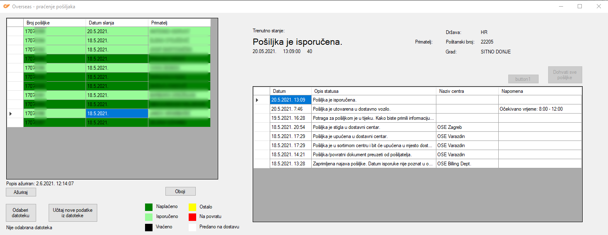

# overseas
Overseas - tracking packages based on .xls file generated on overseas website

While working with system provided by Overseas Express, we've seen that tracking individual shippments is really hard - we needed to open all shipments, select one, click on show details and we could only see details from that one shippment. For the next one we had to repeat the process. After sending more and more packages daily, that became overwhelming so I decided to do something about it and thats where this project comes in.  

On Overseas's dashboard, there is an action that allows to export data in .xls file. So, after some reverse engineering Overseas's tracking site (using Chrome and build in Network tool), I found tracking API. Using the data and the API, I created this Windows app.  

Usage is simple:  
1) Export data from Overseas in .xls file  
2) Open the app and select the file  
3) Click Load data from file  

And thats it. The app shows all shippments in the file, grabs all shipping data for them and colors each shippent for easier tracking. Data is also saved to the disk so next time user opens the app, all data is here. There is also Update button that updates all non delivered shippments in the current list (delivered shippments are skipped).

  

 
Update (3.8.2021.)   

Overseas changed their way of fetching data for shippments and this app no longer works. Since their system now supports functionalities of this app, this app was discontinued.

